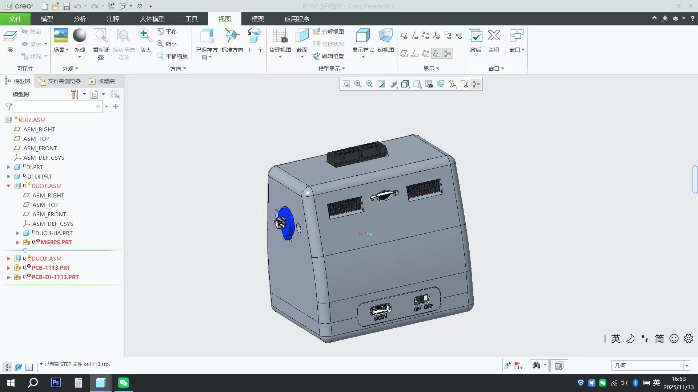
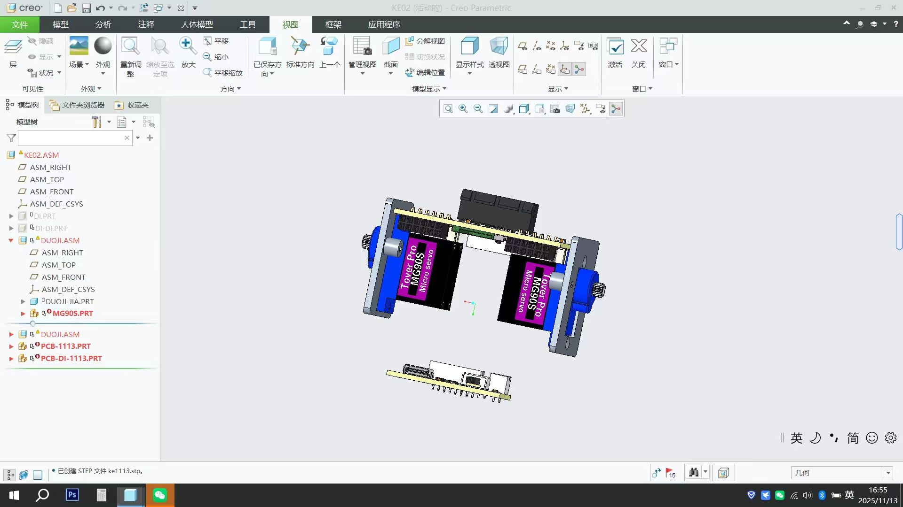
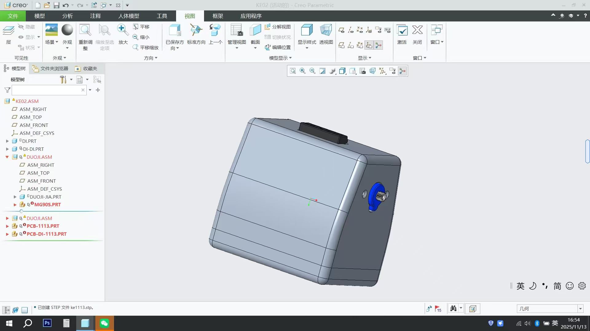
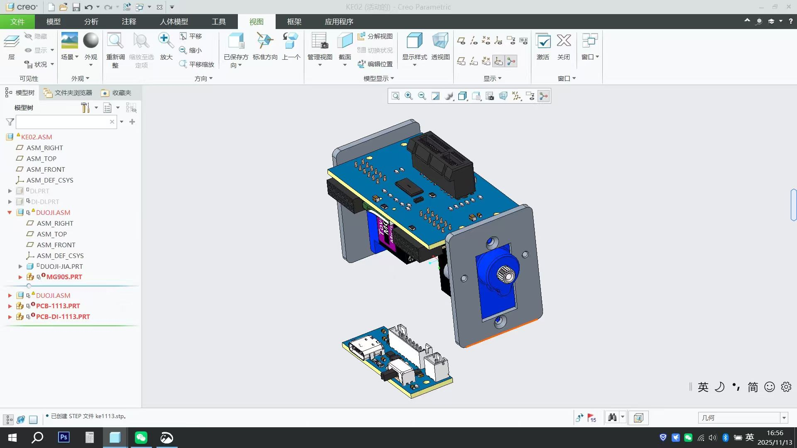
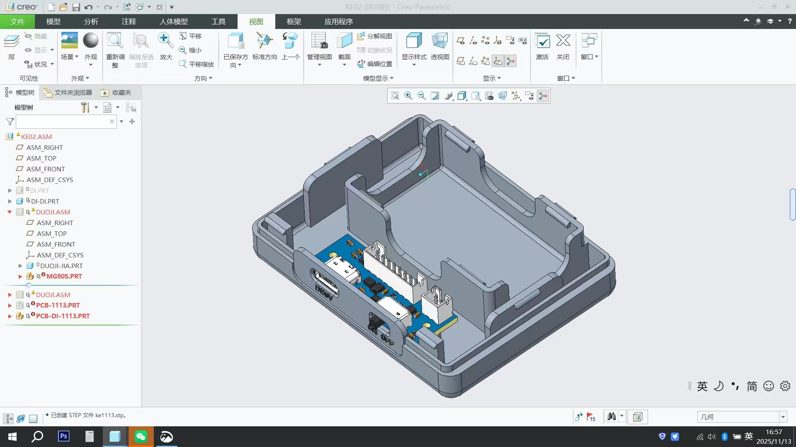
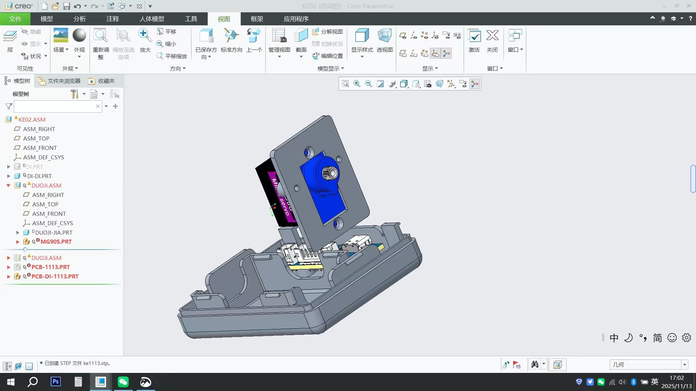
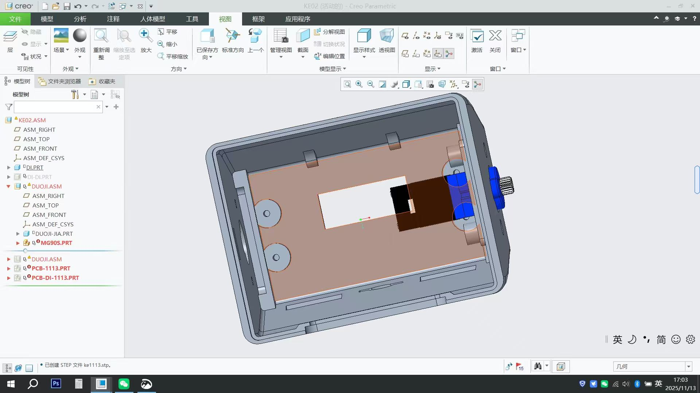
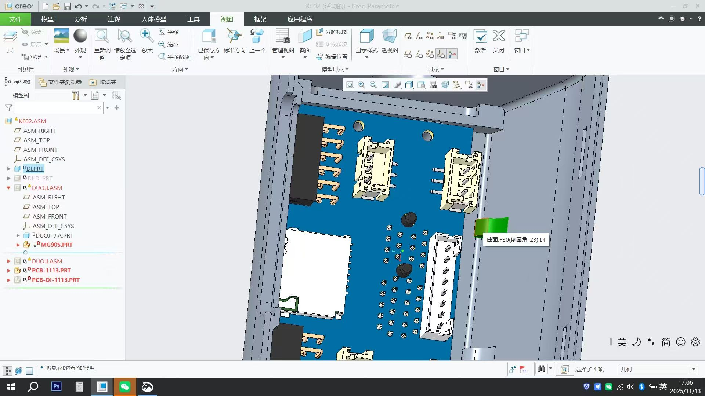

# Cyber Spirit 机器人底座

<p align="center">
  
</p>

<p align="center">
  <strong>软硬件结合的多模态 AI 情感陪伴机器人 —— 硬件底座开源设计</strong>
</p>

<p align="center">
  <a href="https://opensource.org/licenses/MIT"></a>
  <a href="https://www.oshwa.org/"></a>
  <a href="https://www.bilibili.com/video/BV16Lz9BJEWe"></a>
</p>

<p align="center">
  <a href="https://cyberspirit.io">官方网站</a> •
  <a href="https://docs.cyberspirit.io">使用文档</a> •
  <a href="https://www.bilibili.com/video/BV16Lz9BJEWe">演示视频</a>
</p>

---

## ✨ 关于本项目

本仓库开源的是 **Cyber Spirit 机器人底座** 的硬件设计文件，包含 3D 外壳模型、PCB 工程文件和电路原理图，让你能够 DIY 自己的实体机器人底座！

## 🎬 演示视频

[](https://www.bilibili.com/video/BV16Lz9BJEWe)

## 📷 结构预览

| 外观展示 | 内部结构 |
|:---:|:---:|
|  |  |
|  |  |

<details>
<summary>📸 查看更多图片</summary>

| 描述 | 图片 |
|:---:|:---:|
| 外壳内部 |  |
| 电池仓 |  |
| 舵机组件 |  |
| 内部布局 |  |
| PCB 细节 |  |

</details>

## 📁 文件说明

```
cyber-spirit-robot-base/
├── README.md                     # 项目说明文档
├── 机器人底座外壳.stp             # 3D 外壳模型文件 (STEP 格式)
├── pcb工程文件.epro              # PCB 工程文件 (立创 EDA 格式)
├── 电池电路原理图.pdf             # 电池管理电路原理图
├── 舵机驱动电路原理图.pdf          # 舵机驱动电路原理图
└── 1-9.jpeg                      # 结构展示图片
```

## 🔧 硬件规格

### 机械结构

| 参数 | 规格 |
|:---|:---|
| 自由度 | 1 DOF |
| 舵机型号 | Tower Pro MG90S × 2 |
| 外壳材质 | 建议使用 PLA/ABS 3D 打印 |
| 外壳格式 | STEP (.stp) |

### 电气参数

| 参数 | 规格 |
|:---|:---|
| 工作电压 | DC 5V |
| 充电接口 | USB Type-C |
| 电源接口 | DC 5V 圆孔接口 |
| 电池类型 | 锂电池 (具体规格见原理图) |

### 接口说明

| 接口 | 功能 |
|:---|:---|
| USB Type-C | 电池充电 |
| DC 5V | 外部供电 |
| ON/OFF 开关 | 电源开关 |
| 舵机接口 | 连接 MG90S 舵机 |

## 🚀 使用指南

### 1. 获取文件

```bash
git clone https://github.com/your-username/cyber-spirit-robot-base.git
```

### 2. 3D 打印外壳

1. 使用支持 STEP 格式的 CAD 软件打开 `机器人底座外壳.stp`
2. 导出为 STL 格式进行 3D 打印
3. 建议打印参数：
   - 层高：0.2mm
   - 填充率：20-30%
   - 支撑：根据打印方向选择

### 3. PCB 制作

1. 使用 [立创 EDA](https://lceda.cn/) 打开 `pcb工程文件.epro`
2. 可直接下单 PCB 打样或导出 Gerber 文件

### 4. 组装流程

#### 步骤一：准备元器件

根据原理图准备以下主要元器件：

**电池板：**
- LGS4056HDA 锂电池充电芯片
- SY7088DGC DC-DC 升压芯片
- USB Type-C 接口
- PH2.0 电池接口
- 充电指示 LED
- 电源开关
- 相关电阻电容

**舵机驱动板：**
- PCA9685 PWM 舵机驱动芯片
- ESP32-S3 连接器
- PH2.0 舵机接口
- TF 卡槽（可选）
- 相关电阻电容

#### 步骤二：PCB 焊接

1. 先焊接小型贴片元件（电阻、电容）
2. 焊接芯片（LGS4056HDA、SY7088DGC、PCA9685）
3. 焊接接口（USB Type-C、PH2.0 接口、排针）
4. 焊接开关和 LED

#### 步骤三：3D 打印外壳

1. 使用 CAD 软件打开 `机器人底座外壳.stp`
2. 导出为 STL 格式
3. 建议打印参数：层高 0.2mm，填充率 20-30%

#### 步骤四：机械组装

1. 将两个 MG90S 舵机安装到舵机支架上（两个舵机水平并排放置）
2. 将舵机支架组件放入底座外壳，水平旋转舵机的输出轴穿过外壳侧面开孔
3. 将 PCB 板安装到底座外壳内的固定位置
4. 将电池放入电池仓
5. 安装顶部平台，与俯仰舵机的输出轴连接
6. 盖上外壳顶盖

#### 步骤五：电气连接

1. 将电池通过 PH2.0 接口连接到电池板
2. 将舵机线连接到驱动板的舵机接口（SERVO0、SERVO1）
3. 通过 8P 排线连接电池板和舵机驱动板
4. 连接 ESP32-S3 主控板

#### 步骤六：测试

1. 打开电源开关
2. 检查充电指示灯是否正常
3. 测试舵机是否能正常转动

## 📐 原理图说明

| 文件 | 说明 |
|:---|:---|
| `电池电路原理图.pdf` | USB Type-C 充电电路 + LGS4056HDA 锂电池充电管理 + SY7088DGC 升压电路 |
| `舵机驱动电路原理图.pdf` | PCA9685 PWM 舵机驱动 + ESP32-S3 连接器 + TF 卡槽 |

## 🔗 相关链接

| 链接 | 说明 |
|:---|:---|
| [cyberspirit.io](https://cyberspirit.io) | 官方网站 |
| [docs.cyberspirit.io](https://docs.cyberspirit.io) | 使用文档 |
| [演示视频](https://www.bilibili.com/video/BV16Lz9BJEWe) | B站演示视频 |

## 🤝 贡献与反馈

欢迎提交 Issue 和 Pull Request！

无论是硬件底座相关问题，还是 Cyber Spirit 产品的任何建议和反馈，都可以在本仓库的 [Issue](../../issues) 中提出，我们会认真查看每一条反馈喵～

## 📄 许可证

- 软件代码：[MIT License](LICENSE)
- 硬件设计：[CERN Open Hardware Licence v2](https://ohwr.org/cern_ohl_p_v2.txt)

---

<p align="center">
  <strong>Cyber Spirit</strong> - 让 AI 成为你的情感伙伴 ✨
</p>

<p align="center">
  <sub>软硬件结合 · 多模态交互 · 情感陪伴</sub>
</p>
